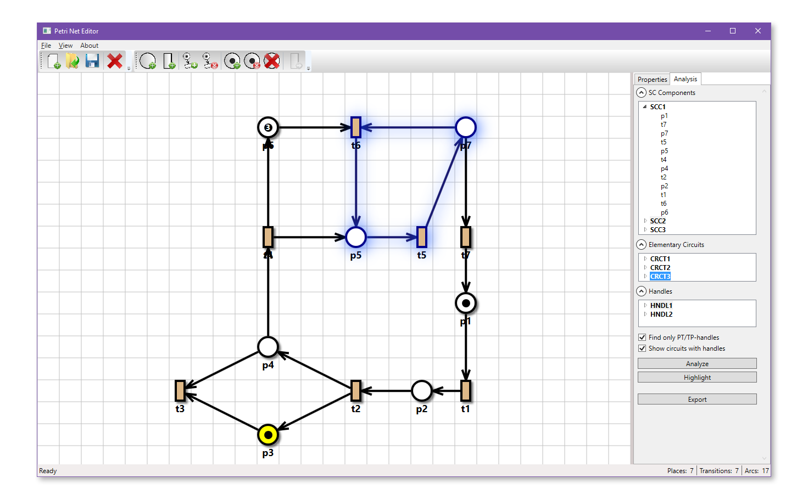

# Petri Net Editor

A minimalist Petri net editor capable of simple structural analysis. It can find circuits, handles and bridges in a Petri net (as described in [this paper](https://link.springer.com/chapter/10.1007/3-540-53863-1_27)).

You can add, remove and connect nodes, add tokens and fire transitions, export the net and decomposition results in XML. Move nodes with the left mouse button, select with the right. Automatic net layout is based on [a force-directed algorithm](https://en.wikipedia.org/wiki/Force-directed_graph_drawing).

## Disclaimer

The app was written as a university project in 2015. I don't update or maintain it.

## Building

Open the `.sln` file in Visual Studio and choose **Build - Build solution**.

The resulting `.exe` file will be generated under `NetEditor/bin/Debug` (or `NetEditor/bin/Release`).

## Screenshots

